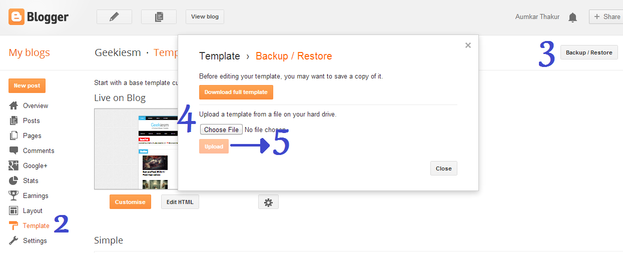
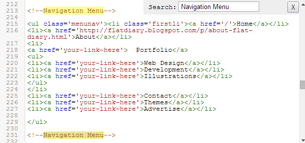
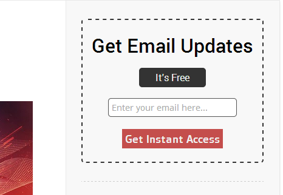
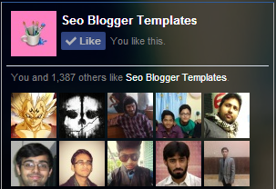
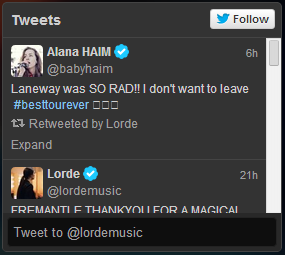

# SEO MAG Template

## How To Install Blogger Template

For these you need a account on blogger.com where you can create a free blog, In this guide I'm not going to tell you that how you can create a blog on blogger, I assume that you have a blogger account with a blogger blog, so let's get started!

**Also Read:**[ Complete Guide To Setup Blog](http://blog.seobloggertemplates.com/2013/10/a-complete-guide-to-setting-up-blog.html)

*   Go To Blogger **Dashboard**
*   On Blogger Dashboard click **Template**
*   Now Click On **Backup/Restore** button (Top Right).
*   Click **Choose File** button. Find where the &#x201c;seomag-theme.xml&#x201d; file location.
*   Now Click On** Upload** Button.

## How to Customize Menu Navigation

Navigation menu will helps to make site user friendly, You can add label links, page links, affliate links or any external website link by just changing it little bit.  

*   Go To Blogger **Dashboard**
*   On Blogger Dashboard click **Template**
*   Now Click On **Edit HTML** button
*   Now Find  `&lt;!--Navigation Menu--&gt;` in template code using **ctrl+f**
*   Now you will see navigation menu code, just change its text and link according to your need.

## Add Your Feedburner username

Email Subscription box will help you to make your blog viral using email marketing, to add your own feedburner user name follow below steps:

*   Go To Blogger **Dashboard**
*   Click On **Layout** Tab
*   Now Click on **Add Gadget** and add html/javascript
*   Now Just Copy and paste below code there:

<pre class="codebox">
&lt;form class=&quot;emailbox&quot; action=&quot;http://feedburner.google.com/fb/a/mailverify&quot; method=&quot;post&quot; target=&quot;popupwindow&quot; onsubmit=&quot;window.open('http://feedburner.google.com/fb/a/mailverify?uri=seotemplates', 'popupwindow', 'scrollbars=yes,width=550,height=520');return true&quot;&gt;&lt;div class=&quot;etitle1&quot;&gt;Get Email Updates&lt;/div&gt;
&lt;div class=&quot;etitle2&quot;&gt;It's Free&lt;/div&gt;
&lt;center&gt;&lt;p&gt;&lt;input type=&quot;text&quot; class=&quot;inputof&quot; placeholder=&quot;Enter your email here...&quot; name=&quot;email&quot;/&gt;&lt;/p&gt;&lt;input type=&quot;hidden&quot; value=&quot;seotemplates&quot; name=&quot;uri&quot;/&gt;&lt;input type=&quot;hidden&quot; name=&quot;loc&quot; value=&quot;en_US&quot;/&gt;&lt;input type=&quot;submit&quot; value=&quot;Get Instant Access&quot; class=&quot;btnof&quot; /&gt;&lt;/center&gt;&lt;/form&gt;
</pre>

Now replace **seotemplates** with your feedburner username.

**Read This:**[
Step by Step Guide to Setup FeedBurner for Blogger](http://blog.seobloggertemplates.com/2013/10/step-by-step-guide-to-setup-feedburner.html)

## How to Add Like Box

For adding facebook like box to blogger, go to official [Like Box Generator](https://developers.facebook.com/docs/plugins/like-box-for-pages/) and then paste your page URL and then click on **Get Code** button, Now select **iFrame** Copy given code and paste it in HTML/Javascript by adding New gadget in layout tab.

## How to Add Twitter Feed Box

Twitter is very popular social media websites. Like others social networks, Twitter also plays an important role for every blog and website.

*   Go To Blogger **Dashboard**
*   Click On **Layout** Tab
*   Now **Add Gadget** >> **HTML/JavaScript**
*   Paste below code there:
	<pre class="codebox">
&lt;a class=&quot;twitter-timeline&quot; href=&quot;https://twitter.com/**lordemusic**&quot; data-widget-id=&quot;429486347175211008&quot;&gt;Tweets by @**lordemusic**&lt;/a&gt;
&lt;script&gt;!function(d,s,id){var js,fjs=d.getElementsByTagName(s)[0],p=/^http:/.test(d.location)?'http':'https';if(!d.getElementById(id)){js=d.createElement(s);js.id=id;js.src=p+&quot;://platform.twitter.com/widgets.js&quot;;fjs.parentNode.insertBefore(js,fjs);}}(document,&quot;script&quot;,&quot;twitter-wjs&quot;);&lt;/script&gt;
</pre>

*   Replace `lordemusic` with your twitter username.